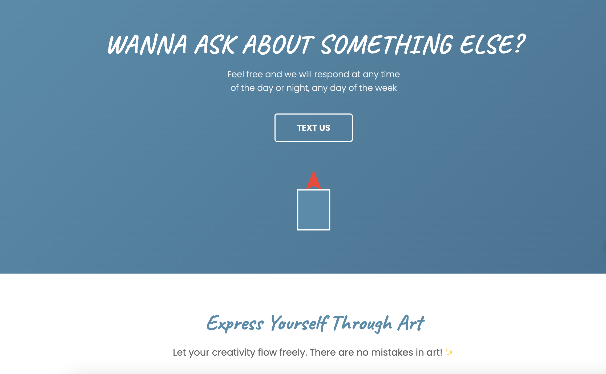
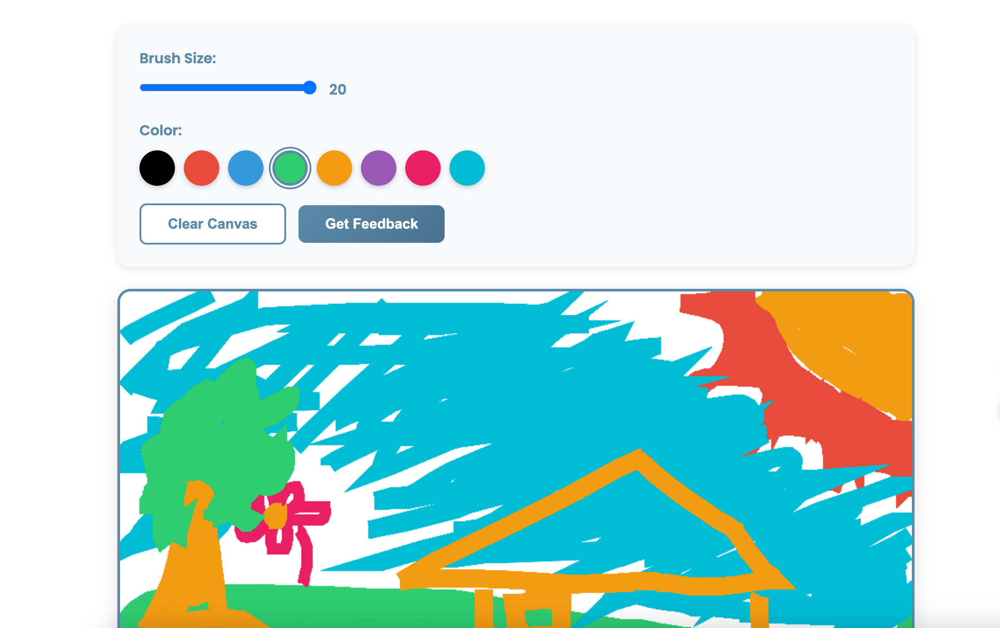
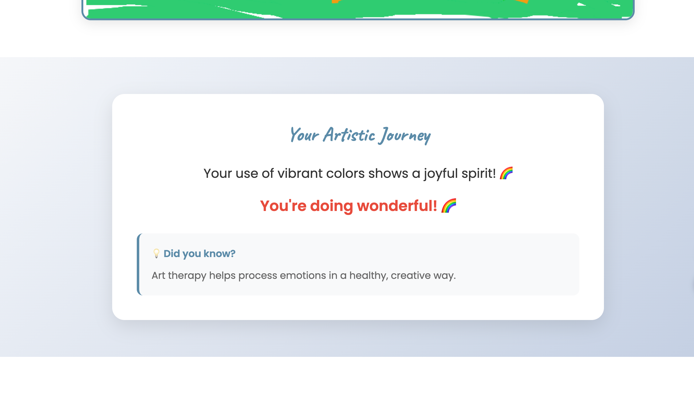

# Therapeutic Drawing Website 🎨

A healing-focused web application where users can draw freely and receive encouraging feedback on their artwork. Built with Python Flask and vanilla JavaScript.

## Screenshots

### Landing Page

*Calming blue-themed hero section with encouraging messaging*

### Drawing Canvas & Tools

*Interactive canvas with color palette, brush controls, and example artwork*

### Therapeutic Feedback

*Personalized, encouraging feedback based on your artwork*

## Features

✨ **Therapeutic Drawing Canvas**
- Interactive HTML5 canvas for free-form drawing
- Multiple colors and adjustable brush sizes
- Touch-screen support for mobile devices
- Smooth, responsive drawing experience

💝 **Encouraging Feedback**
- Python-based analysis of artwork
- Personalized, uplifting messages
- Therapeutic tips and insights
- Positive reinforcement system

🎨 **Healing UI Design**
- Calming blue color scheme
- Hand-drawn typography
- Soft, welcoming interface
- Mobile-responsive design

## Installation

### Prerequisites
- Python 3.7 or higher
- pip (Python package manager)

### Setup

1. Navigate to the project directory:
```bash
cd /Users/zyf/Desktop/mini-game
```

2. Install required Python packages:
```bash
pip install -r requirements.txt
```

Or install manually:
```bash
pip install Flask==3.0.0 Werkzeug==3.0.1
```

## Running the Application

1. Start the Flask server:
```bash
python app.py
```

2. Open your web browser and navigate to:
```
http://localhost:5000
```

3. Start drawing and receive therapeutic feedback! 🎨

## How to Use

1. **Draw**: Use your mouse or touch screen to draw on the canvas
2. **Choose Colors**: Select from the color palette
3. **Adjust Brush**: Use the slider to change brush size
4. **Get Feedback**: Click "Get Feedback" to receive encouraging messages
5. **Clear Canvas**: Start fresh with the "Clear Canvas" button

## Project Structure

```
mini-game/
├── app.py                  # Flask backend application
├── requirements.txt        # Python dependencies
├── templates/
│   └── index.html         # Main HTML template
├── static/
│   ├── css/
│   │   └── style.css      # Styling and animations
│   └── js/
│       └── canvas.js      # Canvas drawing logic
└── README.md              # This file
```

## Features in Detail

### Drawing Canvas
- Supports mouse and touch input
- Adjustable brush size (1-20px)
- 8 pre-selected therapeutic colors
- Clear canvas functionality
- Responsive canvas sizing

### Feedback System
The Python backend analyzes drawings based on:
- Number of strokes (complexity)
- Colors used (emotional expression)
- Drawing patterns

Feedback categories include:
- **Colorful**: For vibrant, multi-colored drawings
- **Detailed**: For complex artwork with many strokes
- **Simple**: For minimalist, peaceful drawings
- **General**: Encouraging messages for all artwork

### Therapeutic Tips
Each feedback includes a therapeutic insight such as:
- "Drawing can reduce stress and anxiety by 84% after just 5 sessions!"
- "Art therapy helps process emotions in a healthy, creative way."
- And more...

## Customization

### Adding More Colors
Edit `templates/index.html` in the color palette section:
```html
<button class="color-btn" data-color="#YOUR_COLOR" style="background: #YOUR_COLOR;"></button>
```

### Customizing Feedback Messages
Edit `app.py` and modify the `FEEDBACK_MESSAGES` dictionary:
```python
FEEDBACK_MESSAGES = {
    'colorful': [
        "Your custom message here! 🌈",
    ],
    # Add more categories...
}
```

### Styling Changes
Modify `static/css/style.css` to customize:
- Color schemes
- Fonts
- Layout
- Animations

## Browser Support

- Chrome (recommended)
- Firefox
- Safari
- Edge
- Mobile browsers with touch support

## Technical Details

**Backend**: Python Flask
- RESTful API endpoints
- JSON data handling
- Drawing analysis algorithm

**Frontend**: Vanilla JavaScript
- ES6+ features
- Canvas API
- Fetch API for async requests
- Touch event handling

**Styling**: Pure CSS
- Flexbox & Grid layouts
- CSS animations
- Responsive design
- Custom properties

## Future Enhancements

Potential features to add:
- Save drawings to database
- User accounts and drawing gallery
- More sophisticated AI analysis
- Export drawings as images
- Sharing capabilities
- Drawing tutorials
- Progress tracking over sessions

## License

This project is open source and available for personal and educational use.

## Support

For issues or questions, please create an issue in the project repository.

---

**Remember**: There are no mistakes in art, only opportunities for creativity! 🌟
